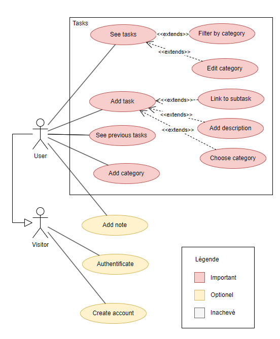

# INFO734 todo list
Une application Node construite avec MongoDB et Angular.

Node fournit une API RESTful (avec Express) lié MongoDB.

Angular fournit le frontend et accède à l'API.

# Launch
Pour lancer l'appli, utiliser deux terminal bash :
- Un pour le frontend -> `cd frontend; ng serve;`
- Un pour le backend -> `cd backend; node app.js;` ou `cd backend; npm run dev;` pour le dev

# Use case v1
