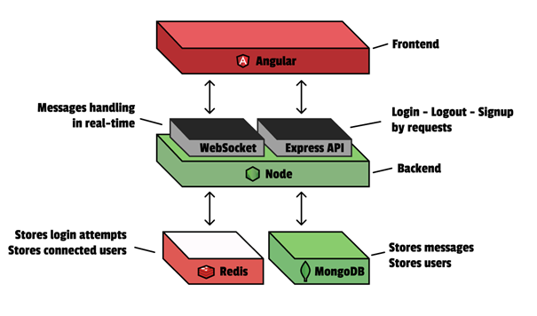

# INFO834 - ✝Messagé
Une application de web chat en temps réel.

Coté backend : Node fournit une API REST avec Express, lié à une base de données MongoDB et à Redis.

Coté frontend : Angular fournit le frontend et accède à l'API.

# Installation
Avant de passez à la partie launch, pensez à télécharger les dépendances:
- `cd frontend; npm install; cd ../backend; npm install;`

# Launch
Pour lancer l'appli, utiliser trois terminals bash :
- Pour le frontend -> `cd frontend; ng serve;`
- Pour le backend -> `cd backend; node app.js;` ou `cd backend; npm run dev;` pour le dev
- Pour le serveur Redis (avec un terminal **WSL**) -> `redis-server --port 6379`
Pensez à vous connectez au VPN pour avoir accès à la base Mongos

- (optionel) Pour tester Redis (terminal **WSL**) -> `redis-cli`
- (optionel) Pour tester MongoDB -> `mongosh --host 193.48.125.44 --port 27017 --username scadereau --password haa00` puis `use hugougolois`

# Redis
Commandes pour tester redis, à lancer sur le client Redis
`FLUSHDB` pour vider les données
`KEYS *` pour voir toutes les données
`HGET user:65ddc1ac007f09cc725ad3a6 token` pour récupérer le token d'un user

# MongoDB
Commandes pour tester MongoDB, à lancer sur le client MongoDB
`db.users.find()` voir tout les utilisateurs
`show collections` voir tout les schémas
