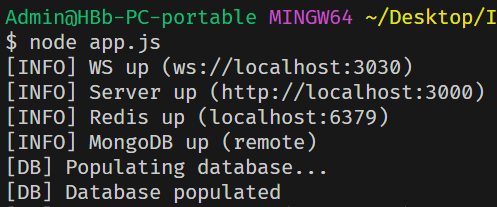
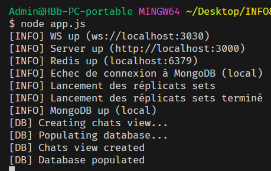

# INFO834 - ✝Messagé
Une application de web chat en temps réel.

Coté backend : Node fournit une API REST avec Express utilisé pour l'authentification, ainsi qu'un système de web socket pour diffuser les messages en temps-réel, créer de nouvelles conversations, ajouter des personnes dans un conversation... Tout est lié à une base de données MongoDB et à un cache Redis.

Coté frontend : Angular fournit le frontend et accède à l'API.

# Installation
Avant de passez à la partie launch, pensez à télécharger les dépendances :
`cd frontend; npm install; cd ../backend; npm install;`

# Launching
Pour lancer l'appli, utiliser trois terminals bash :
- Pour le frontend -> `cd frontend; ng serve;` (ou `npm run ng serve`)
- Pour le serveur Redis -> `redis-server --port 6379`
- Pour le backend -> `cd backend; node app.js;` (ou `cd backend; npm run dev;` pour le dev)
- Se rendre sur `http://localhost:4200`

## Deux possibilités pour MongoDB
En remote ou en local. Voir la variable `mongo_choice` dans `backend/db.js`
- Si `mongo_choice = 'remote'`, ⚠️SE CONNECTER AU VPN⚠️ pas de réplicats
- Si `mongo_choice = 'local'`, ⚠️AVOIR INSTALLER MONGO SERVER⚠️ mongo server se lance avec des réplicats (attendre 15 secondes le temps que le script se lance)

Si tout s'est bien passé, vous devriez obtenir en remote :

Ou en local

# Stopping
- Arrêter le serveur redis -> `redis-cli shutdown`
- Arrêter le serveur MongoDB (local) -> `./backend/stop-mongodb.sh`

# Testing (optionnel)
- Pour tester Redis -> `redis-cli`
- Pour tester MongoDB en remote -> `mongosh --host 193.48.125.44 --port 27017 --username scadereau --password haa00` puis `use hugougolois`
- Pour tester MongoDB en local -> `mongosh --port 27018` (ou 27019 ou 27020) puis `use hugougolois`

## Commandes Redis
Commandes pour tester redis, à lancer sur le client Redis
- `FLUSHDB` pour vider les données
- `KEYS *` pour voir toutes les données
- `HGETALL user:65ddc1ac007f09cc725ad3a6` pour récupérer les infos d'un utilisateur
- `DEL user:65ddc1ac007f09cc725ad3a6` pour déconnecter un utilisateur

## Commandes MongoDB
Commandes pour tester MongoDB, à lancer sur le client MongoDB
- `db.users.find()` voir tout les utilisateurs
- `show collections` voir tout les schémas